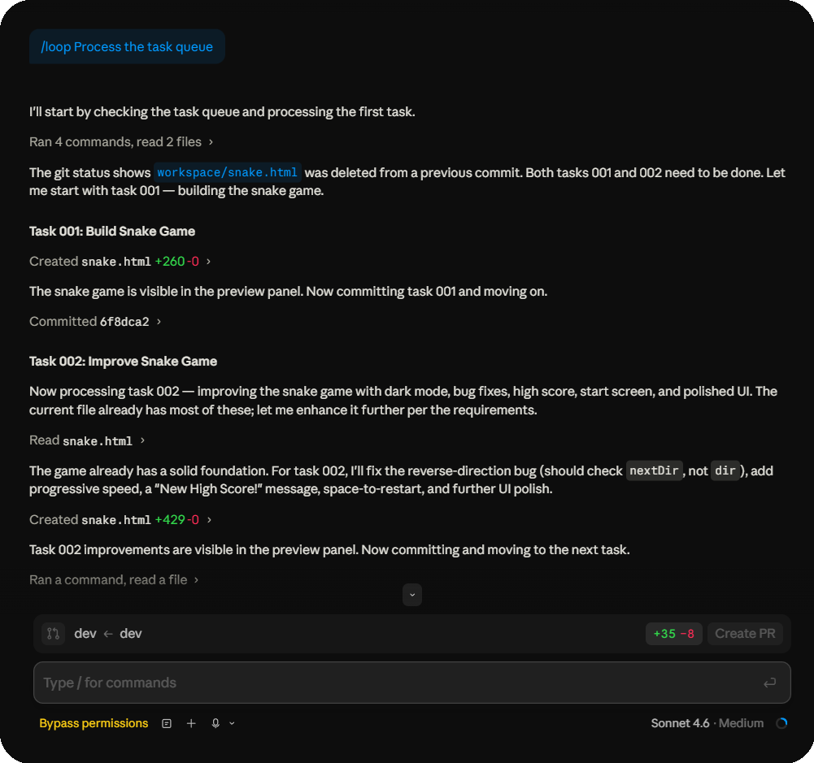

<div align="center">
  <br/>
  <h1>Claude-Sisyphus</h1>
  <strong>An autonomous task queue runner for Claude Code.</strong><br/>
  Write tasks. Run one command. Walk away.
</div>

---

In [Greek mythology](https://en.wikipedia.org/wiki/Sisyphus), Sisyphus was condemned to roll a boulder up a hill for eternity, only for it to roll back down each time. This is that, but the boulder actually stays at the top.

Load up a queue of tasks and Claude will work through them relentlessly, reading, building, committing, moving on, one by one, for as long as there's work to do. It never loses its place. The queue state lives in the filesystem, not the conversation, so even after context compaction Claude just looks at `tasks/`, sees what isn't in `done/` yet, and picks up exactly where it left off.

The only things that stop it: the queue runs dry, or you run out of credits.



---

## Prerequisites

- [Claude Code](https://claude.ai/code) installed and signed in
- Git installed on your machine ([download here](https://git-scm.com/downloads) if you don't have it)

---

## First-Time Setup

Do this once when you first clone the repo. It takes about two minutes.

### Step 1 — Clone the repo

```bash
git clone https://github.com/Multimodal-Agents/Claude-Sisyphus.git
cd Claude-Sisyphus
```

### Step 2 — Enable push protection

This installs the git hook that prevents anything from being pushed to your remote while Sisyphus is running — including you accidentally pushing mid-run.

**Mac / Linux / Git Bash:**
```bash
bash scripts/hook.sh on
```

**Windows (Command Prompt or PowerShell):**
```powershell
scripts\hook.bat on
```

### Step 3 — Harden the protection (recommended)

The hook alone can be bypassed if a task instructs Claude to disable it. These two steps lock it in place so nothing can tamper with it.

**Mac / Linux:**
```bash
chmod 444 .claude/settings.json
chmod 444 .git/hooks/pre-push
git remote set-url --push origin no_push
```

**Windows:**
```powershell
attrib +R .claude\settings.json
attrib +R .git\hooks\pre-push
git remote set-url --push origin no_push
```

> If you ever need to push manually, see [`human_only/unlocking.md`](human_only/unlocking.md) for the full unlock walkthrough.

### Step 4 — Clear the example tasks

The repo ships with example tasks in `tasks/` (a snake game demo). Delete them before adding your own:

```bash
rm tasks/*.md
```

Or just delete them manually in your file explorer. Leave the `done/` and `failed/` subfolders in place.

### Step 5 — Write your tasks

Tasks are plain markdown files in the `tasks/` folder. Name them with a number prefix so Claude processes them in the right order.

```
tasks/
  001_build_homepage.md
  002_add_dark_mode.md
  003_write_tests.md
```

Write each task like a prompt. Be specific about what you want and where to save the output:

```markdown
# tasks/001_build_homepage.md

Build a single-page HTML landing page for a coffee shop.
Save it to workspace/index.html.

Requirements:
- Hero section with a tagline
- Menu section with 5 items
- Contact form (no backend needed)
- Clean, modern design with a warm color palette
```

All output files go to `workspace/` automatically.

### Step 6 — Open Claude Code in this folder

Launch Claude Code (CLI, desktop app, or IDE extension) with the `Claude-Sisyphus` folder as your working directory.

---

## Running the Task Queue

### Step 1 — Turn on Bypass Permissions

Enable **Bypass permissions** in Claude Code before starting the loop.

Where to find it:
- **CLI:** press `Shift+Tab` to cycle through permission modes until you see `bypass` in the status line
- **Desktop app:** click the permission mode indicator at the bottom of the window
- **IDE extension (VS Code / JetBrains):** click the permission mode in the Claude Code sidebar

> **What this does:** Normally Claude asks for your approval before running shell commands, writing files, or committing to git. Bypass permissions lets it do all of that automatically so it can work through the queue without stopping every few seconds to ask. You can turn it off again after the run.
>
> **Is it safe?** The push protection hook and hardening steps in setup ensure Claude cannot push anything to your remote, so the main risk — code leaving your machine — is covered. Everything else stays local.

### Step 2 — Run the loop command

Type this in the Claude Code input and press Enter:

```
/loop Process the task queue
```

> **What `/loop` is:** A built-in Claude Code slash command that runs a prompt on repeat, resuming automatically after each context compaction. It keeps Sisyphus running until the queue is empty without any input from you.

Claude will read the first task, do the work, save output to `workspace/`, commit, move the task to `tasks/done/`, and repeat until the queue is empty. You can watch it run or walk away.

---

## How Tasks Move Through the Queue

```
tasks/001_build_homepage.md      ← Claude reads this
        →  does the work
workspace/index.html             ← output saved here
        →  git commit
tasks/done/001_build_homepage.md ← task archived
        →  moves to next task
tasks/002_add_dark_mode.md       ← repeat
```

If a task is impossible or broken, Claude moves it to `tasks/failed/` and appends a note explaining what went wrong. The queue then continues with the next task.

---

## Push Protection Hook

`CLAUDE.md` tells Claude not to push, but that is just an instruction. The hook is what **actually enforces it** at the git level, making it physically impossible for any push to succeed while it is active — whether the push comes from Claude or from you manually.

**How it works:** Git looks for executable scripts in `.git/hooks/` and runs them automatically at certain points. The `pre-push` hook runs before every push attempt and exits with an error, which cancels the push. That folder is local to your machine and is never committed to the repo, which is why the hook is off by default — cloning gives you the script in `hooks/`, but it does not activate until you install it.

**The hook is per-clone.** If you clone the repo on a new machine or into a new folder, you will need to run the install script again.

To check whether the hook is currently active:

**Mac / Linux / Git Bash:**
```bash
bash scripts/hook.sh
```

**Windows:**
```powershell
scripts\hook.bat
```

---

## Hardening Against a Rogue Agent

The hook and `CLAUDE.md` cover normal operation, but a task could in theory instruct Claude to disable them. The hardening steps in setup close that gap with three independent layers:

| Layer | What it does |
|-------|-------------|
| `.claude/settings.json` (read-only) | Blocks `git push`, hook script execution, and remote URL changes at the Claude Code tool level — before any shell command runs. Read-only so tasks cannot edit it to remove the rules. |
| `.git/hooks/pre-push` (read-only) | Blocks all pushes at the git level. Read-only so tasks cannot delete it. |
| Dead push remote (`no_push`) | Even if both layers above were bypassed, there is no valid remote to push to. |

All three layers are independent. A task would need to defeat all three simultaneously to get anything off your machine.

For unlock instructions, see [`human_only/unlocking.md`](human_only/unlocking.md).

---

## Project Structure

```
.
├── hooks/
│   └── pre-push          # the hook script source, copied to .git/hooks/ on enable
├── scripts/
│   ├── hook.sh           # manage the hook on Mac / Linux / Git Bash
│   └── hook.bat          # manage the hook on Windows
├── tasks/
│   ├── 001_your_task.md  # add your tasks here
│   ├── done/             # completed tasks are moved here automatically
│   └── failed/           # broken tasks land here with an explanation
├── workspace/            # all generated output goes here
├── human_only/           # operator notes, see inside
├── assets/               # images used in this README
├── CLAUDE.md             # rules the agent follows, do not delete or edit
└── README.md
```

---

## Tips

- **Number your tasks** with zero-padded prefixes (`001_`, `002_`) so the order is always predictable.
- **Be specific in task files.** Vague prompts lead to vague output. Include file paths, requirements, and constraints.
- **Check `tasks/failed/`** if Claude gets stuck. The file will have a note about what went wrong.
- **Do not edit `CLAUDE.md`.** It contains the rules the agent follows. Editing it can break the queue or weaken the push protection.
- **The hook is per-clone.** Every new clone needs the setup steps run again.
- **Context compaction is fine.** If Claude's context fills up and compacts mid-run, it will look at `tasks/` on the next turn, see what is not in `done/` yet, and pick up exactly where it left off.

---

## Troubleshooting

**Claude keeps asking for permission even with Bypass Permissions on**
Make sure Bypass Permissions is enabled in the Claude Code window where you ran `/loop`, not a different session.

**The loop stopped before the queue was empty**
Check `tasks/failed/` — a broken task may have caused Claude to stop. You can fix the task and move it back to `tasks/` to retry, or delete it to skip it.

**I accidentally pushed while the hook was off**
Re-enable the hook and hardening steps from setup. If you pushed something you did not mean to, use `git revert` rather than force-pushing to undo it.

**`git push` is blocked and I need to push**
See [`human_only/unlocking.md`](human_only/unlocking.md) for the full step-by-step unlock walkthrough.

**The hook script says "permission denied" on Mac / Linux**
Run `chmod +x .git/hooks/pre-push` to make it executable, then try again.

**I cloned on a new machine and pushes are not blocked**
The hook does not carry over when cloning. Run the setup steps again on the new machine.

---

## Roadmap

- **Failed task retry** - a `tasks/retry/` folder and attempt counter in the filename (`001_build_thing.attempt2.md`) so Claude can try again with context from the previous failure
- **Task dependencies** - a `depends_on: 003` header in task files so Claude can skip blocked tasks instead of failing
- **Task output manifest** - after each task, append a one-line summary to `workspace/MANIFEST.md` for a clean audit trail without spelunking commits
- **Task templates** - a `tasks/templates/` folder with common patterns (refactor, research, bugfix) so you can queue new work fast
- **Utility scripts** - helper scripts for common operations like bulk-creating task files, archiving the workspace, and resetting the queue
- **Local sub-agent support** - scripts for spinning up and routing tasks to local model servers (llama.cpp, vLLM) as drop-in Claude alternatives
